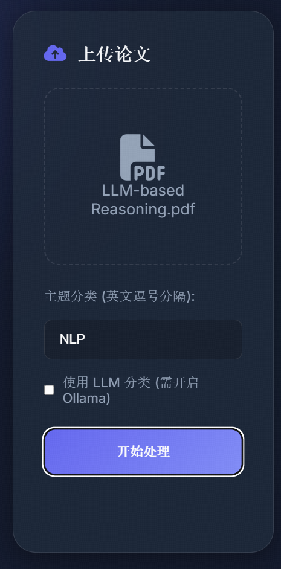
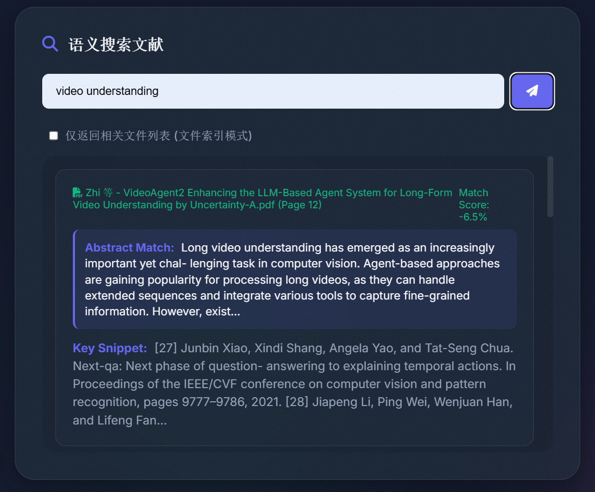
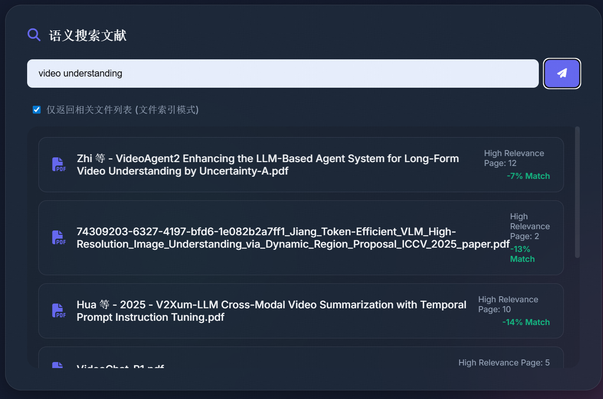
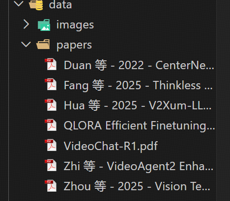
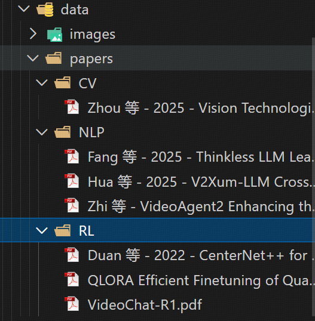
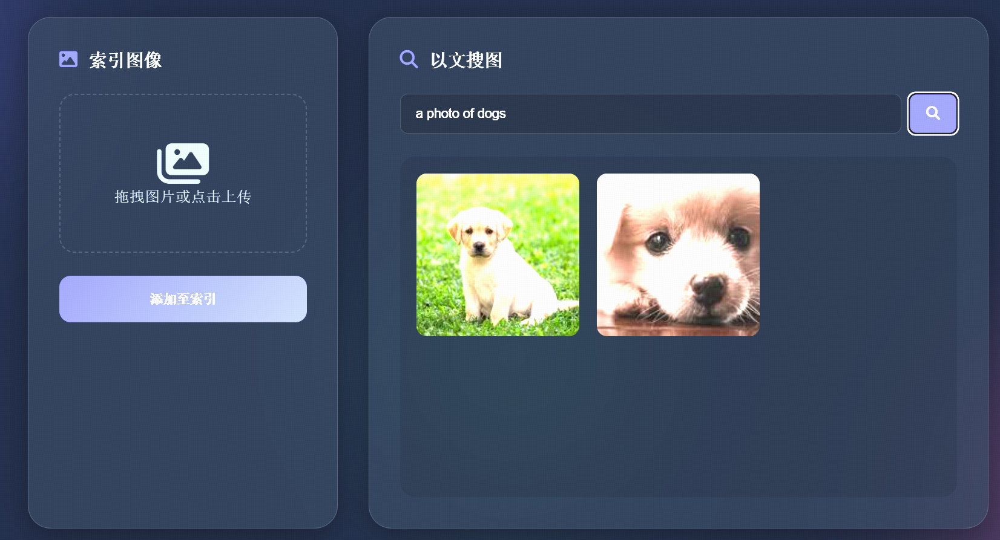
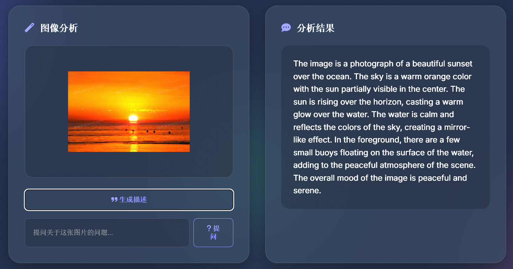

# Local Multimodal AI Agent (本地多模态 AI 智能助手)

## 1. 项目简介 (Project Introduction)
本项目是一个基于 Python 的本地多模态 AI 智能助手，旨在解决本地大量文献和图像素材管理困难的问题。利用多模态神经网络技术（如 CLIP, Florence-2），实现对内容的**语义搜索**、**自动分类**和**多模态问答**。

### 核心功能 (Core Features)
*   **智能文献管理**:
    *   **语义搜索**: 使用自然语言查找相关论文。
    *   **自动分类**: 基于内容自动整理 PDF 到对应主题文件夹。
    *   **批量整理**: 一键扫描并归档混乱的文件夹。
*   **智能图像管理**:
    *   **以文搜图**: 通过文本描述查找图片。
    *   **图像描述**: 自动生成图片的详细描述 (Captioning)。
    *   **视觉问答**: 针对图片内容进行提问 (Visual QA)。

## 2. 环境配置 (Environment Configuration)

### 环境要求

*   **操作系统**: Windows
*   **Python**: 3.9

### 依赖安装
1.  克隆仓库:
    ```bash
    git clone <your-repo-link>
    cd <your-repo-name>
    ```

2.  安装依赖:
    ```bash
    pip install -r requirements.txt
    ```
    *注意: `requirements.txt` 包含 `chromadb`, `sentence-transformers`, `torch`, `transformers` 等核心库。*


## 3. 详细使用说明 (Usage Instructions)

本项目开发了前端UI界面，因此下面指令仅用于说明在终端下如何通过命令行来实现对应功能。项目根目录下的 `main.py` 是统一的入口，支持以下功能：

### 3.1 论文管理

**1. 添加单篇论文并分类**
```bash
python main.py add_paper "path/to/paper.pdf" --topics "CV,NLP,RL"
```
*   `--topics`: 指定分类的主题，逗号分隔。

**2. 搜索论文**
```bash
python main.py search_paper "Transformer architecture"

```

*   `--list-only`: (可选) 仅返回相关文件路径列表。

**3. 整理文件夹 (批量分类)**
扫描指定文件夹下的所有 PDF，并根据主题自动移动到子文件夹。
```bash
python main.py organize_folder "path/to/downloads" --topics "CV,NLP,RL"
```

### 3.2 图像管理

**1. 扫描并索引图像**
将文件夹中的图片建立索引（首次使用前运行）。
```bash
python main.py scan_images "path/to/images"
```

**2. 以文搜图**
```bash
python main.py search_image "sunset on the beach"
```

**3. 图像描述 (Image Captioning)**
使用 Vision LLM (Florence-2) 生成图片描述。
```bash
python main.py describe_image "path/to/image.jpg"
```

## 4. 技术选型 (Technical Stack)

本项目采用模块化设计，支持本地与云端模型。

*   **文本嵌入 (Text Embedding)**: `SentenceTransformers` (all-MiniLM-L6-v2)
    *   用于论文内容的语义向量化。
*   **图像嵌入 (Image Embedding)**: `CLIP` (ViT-B-32)
    *   用于实现“以文搜图”功能。
*   **向量数据库**: `ChromaDB`
    *   本地轻量级向量数据库，存储文本和图像的 Embedding。
*   **视觉语言模型 (Vision LLM)**:
    *   `Microsoft Florence-2` (支持以文搜图、描述)。

## 5. 演示文档 (Presentation Report)

### 5.1 运行截图 (Screenshots)

#### 智能文献管理

##### 单文件处理



提供在对应UI界面上传论文文件，同时指定具体领域，可以在后端实现对应文件的正确分类。

##### 语义搜索



在UI界面中，用户可以输入搜索关键词，系统将返回与关键词最相关的PDF文件。其中，返回的内容包括论文名称、具体页码、具体摘要和对应片段。

##### 文件索引



如果用户只希望系统提供论文名称，而忽略其他的具体内容的话，上述截图可以满足这一需求。

##### 批量整理



上述截图为未进行一键整理前的文件夹结构。



此截图为进行一键整理后的文件夹结构。

#### 智能图像管理

##### 以文搜图



如截图所示，在输入框中输入“a photo of dogs”可以看到界面上显示了两张关于小狗的图片。

##### 图像描述



如上图所示，用户可以上传图片文件，系统将返回对应图片的详细描述。上图主要是对海边落日的场景描述。

### 5.2 演示视频 (Demo Video)

以下是本项目的完整运行视频，主要展示如何在前端进行操作来实现后端的相应功能。


